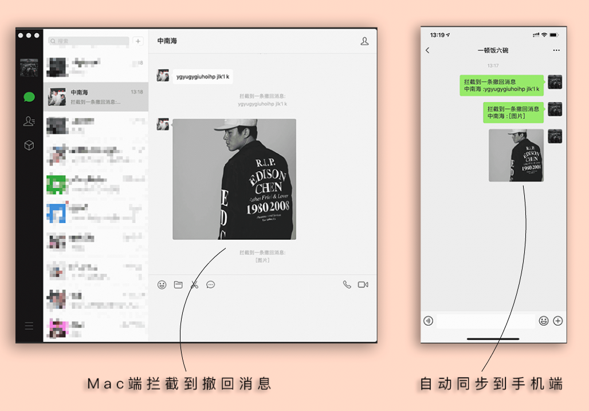
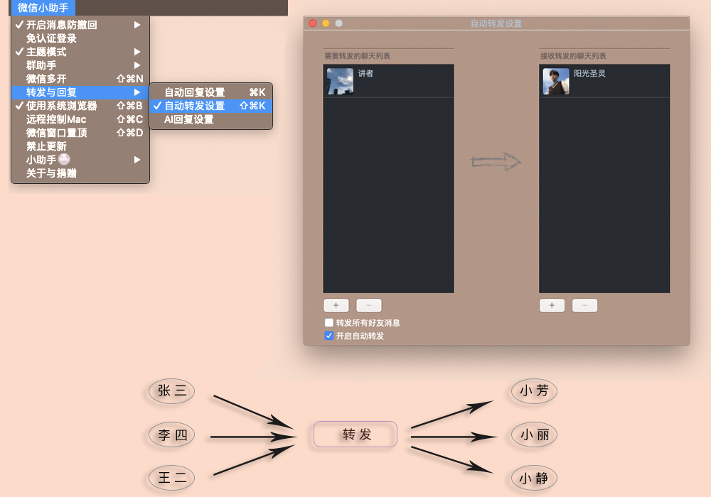
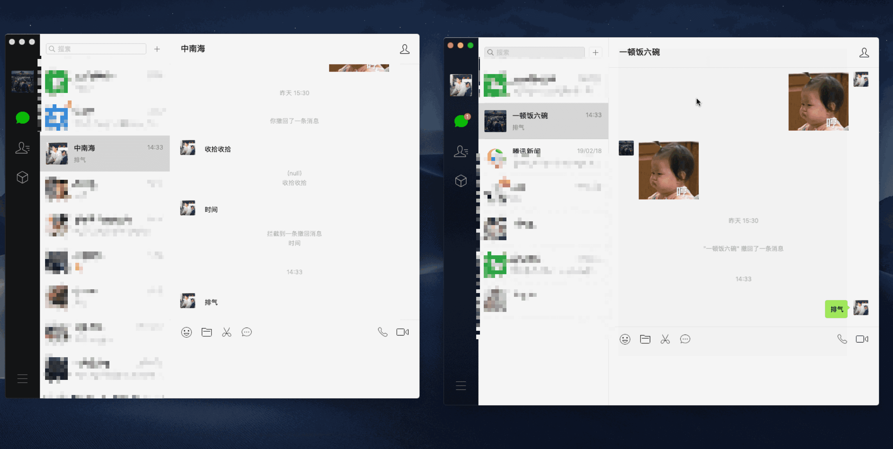
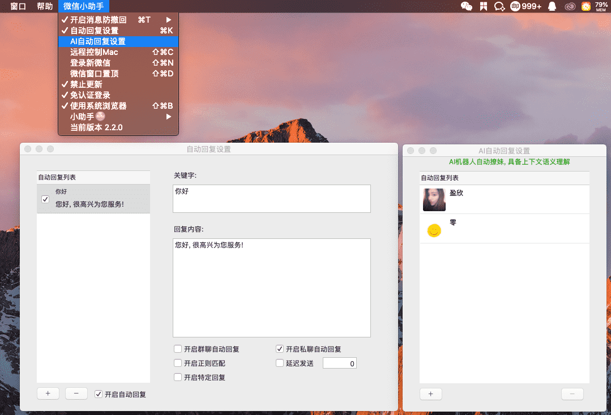
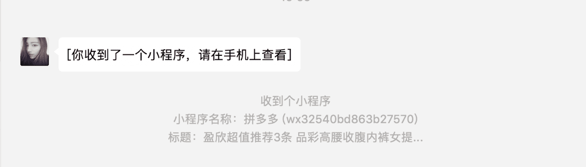
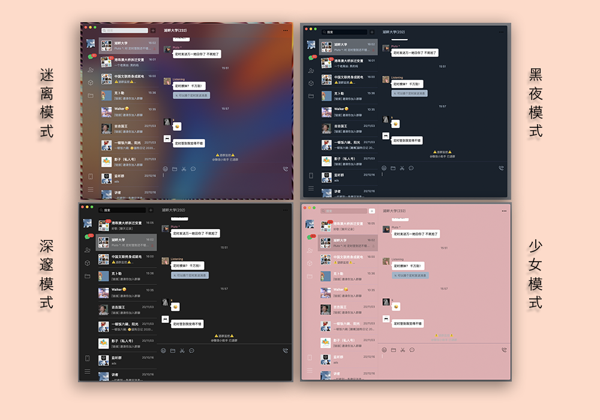
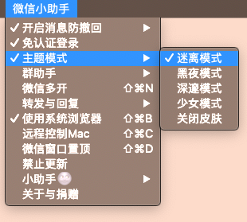
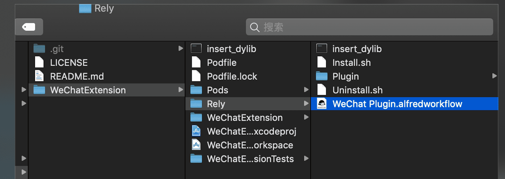
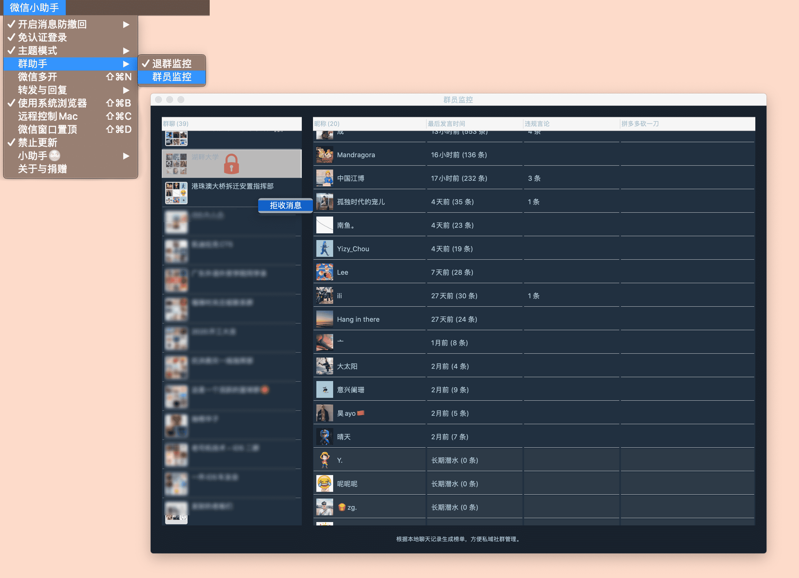

     

## 手机端也能收到被撤回的消息
- 如果Mac拦截到A发送来的消息，手机也会同步收到的这条已经拦截的消息(自己发送给自己)。目前只支持同步文字消息与图片消息。
- 可以对同步的消息进行勾选，以免群消息打扰。

## 消息转发
- Mac可实现多开，出门在外手机却不能，怎样在同一台手机上实现多个微信号消息的监听？
- iPhone上可安装自签的微信包，实现多开，但是Bundle Id的改变导致APNS消息推送异常，无法收到消息推送？
- 目前只能转发文字消息。选择`转发所有好友消息`时，只转发单聊消息，不转发群聊消息。

## 免认证登录与多开
- 可以`同时`登录`多个`微信号。

## 同时支持自定义回复和AI自动撩妹
- 腾讯AI人工智能自动回复，能理解上下文语义。**大量临床试验和大家反馈，腾讯这个AI接口回复不够完善，慎用。**
- 自定义自动回复。

## 显示小程序详情
- 即便Mac微信现在可以`打开`小程序，暂时还`不支持`游戏小程序，所以`保留`了此功能。

## 迷离/黑夜/上帝/少女 皮肤模式
- 少量细节没有做适配，`主题模式-关闭皮肤`可以`关掉`这个功能。
- 群聊中每个发言人的`昵称颜色`都会有所区别。
- 在皮肤模式下，未读消息头像会轻微可爱`摇动`，未读数超过`99条`的会话有`彩蛋`。
- 如果你的迷离模式`未生效`，打开`系统偏好设置` -> `辅助功能` -> `显示`，不要勾选`减少透明度`或`提供对比度`。

- 上帝模式可选一张图片做背景。

- 模式切换

## Alfred
- 确保你电脑中有安装Alfred，双击此文件进行安装。

- 依次点击 `小助手` -> `开启Alfred功能`
- 打开你的Alfred搜索框，输入 `wx `(wx后面接一个空格)，即可开启Alfred控制微信之旅

## 退群监控
- 退群提醒，同一人在同一群里的退出提醒7天内不再重复提示。

## 群员监控
- 微信版本`>=2.4.2（15650）`才支持此功能。
- 群员监控Window中，鼠标右键单击左侧`Session`列表某行出现`拒收消息`，可以在Mac上完全拒收此群消息，避免打扰。
- 右侧列表是依次是`昵称`、相关`发言时间与条数`、`违规言论`、`拼多多砍一刀`。
- 此功能暂时属于`实验性质`。

## FAQ

## Special Thanks
- [微信老助手原作者](https://github.com/MustangYM/WeChatExtension-ForMac)，安装包见[Release](https://github.com/xiaofu666/WechatExtensions/releases/download/3.9.2/app.zip)
- [WeChatPlugin-MacOS](https://github.com/TKkk-iOSer/WeChatPlugin-MacOS)
- [insert_dylib](https://github.com/Tyilo/insert_dylib)
- [fishhook](https://github.com/facebook/fishhook)
- [Alfred](https://www.alfredapp.com/)
- [GCDWebServer](https://github.com/swisspol/GCDWebServer)
- [TCBlobDownload](https://github.com/thibaultcha/TCBlobDownload)
- [ANYMethodLog](https://github.com/qhd/ANYMethodLog)

## License

本项目遵循`MIT license`，方便交流与学习，包括但不限于本项目的衍生品都禁止在损害WeChat官方利益情况下进行盈利。如果您发现本项目有侵犯您的知识产权，请与我取得联系，我会及时修改或删除。

